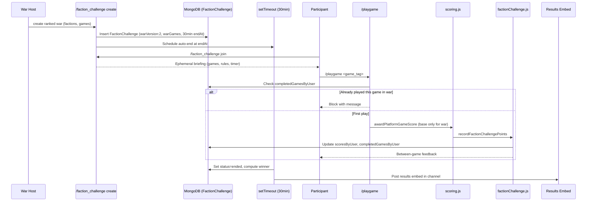

# Design Document — Faction War v2

## Overview

Faction War v2 transforms ranked faction challenges from open-ended grinding sessions into tight, 30-minute tournament-style events. Each player plays each selected game exactly once, scores use base points only (no multipliers), and results auto-post when the timer expires. Unranked/casual wars are completely unchanged.

Key changes from v1:
- Fixed 30-minute duration with auto-end (no manual `/faction_challenge end` for ranked)
- 2–6 faction selection (not just 2-faction duels or all-faction royales)
- 1–3 ranked-eligible platform games per war
- One play per game per player per war (no grinding)
- No roster caps (top-5 averaging handles balance)
- Between-game score feedback
- Results embed posted automatically at war end
- Daily war cap raised from 3 to 6
- Daily `/playgame` limit of 5 outside wars
- Faction concurrency enforcement (no faction in two wars at once)

## Architecture

The v2 changes layer on top of the existing faction challenge system. The core data flow is:



### Component Boundaries

- **deploy-commands.js** — Slash command registration (new options for multi-faction, multi-game)
- **interactionCreate.js** — Command handler orchestration (create, join, end blocking)
- **lib/rankedFactionWar.js** — Validation rules (remove roster cap requirement for v2)
- **lib/factionChallenge.js** — Core war logic (one-play enforcement, score recording, auto-end)
- **lib/factionChallengeDailyLimits.js** — Daily cap (3 → 6)
- **lib/db.js** — Daily `/playgame` session tracking
- **lib/gamePlatform/scoring.js** — War context check before awarding
- **games/platformPlay.js** — War game completion check, replay blocking, feedback
- **models.js** — Schema extensions

## Components and Interfaces

### 1. FactionChallenge Model Extensions (`models.js`)

New fields on `FactionChallengeSchema`:

```javascript
warVersion: { type: Number, default: 1 },
warGames: { type: [String], default: [] },
completedGamesByUser: { type: Map, of: [String], default: () => new Map() },
warDurationMinutes: { type: Number, default: 30 },
```

All fields have defaults so existing v1 documents remain valid. `warVersion: 2` distinguishes v2 wars.

### 2. User Model Extension (`models.js`)

New field on `UserSchema` for daily `/playgame` tracking:

```javascript
dailyPlaygameSessions: { type: Map, of: Number, default: () => new Map() },
```

Keys are UTC date strings (`YYYY-MM-DD`), values are session counts. Old date keys are cleaned up lazily.

### 3. War Creation Handler (`interactionCreate.js` + `deploy-commands.js`)

**Slash command changes:**

The `create` subcommand gains new options for v2 ranked wars:
- `faction_1` through `faction_6` — optional faction selection (2–6 factions). When ≥2 are provided and mode is ranked, creates a v2 war. The existing `faction_a`/`faction_b` options remain for backward compatibility with unranked duels.
- `games` — comma-separated list of 1–3 ranked-eligible platform game tags (e.g. `risk_roll,target_21,multi_step_trivia`). Only used for v2 ranked wars.

**Validation flow for v2 ranked create:**

```
1. Check daily war cap (6 per server per UTC day)
2. Validate faction count (2–6 from global factions, no duplicates)
3. Validate game selection (1–3 tags, each rankedEligible + warScoringEligible)
4. Check faction concurrency (no selected faction in an active/scheduled war)
5. Ignore max_per_team for ranked (no roster cap)
6. Set warVersion=2, warGames=[...], warDurationMinutes=30
7. Set endAt = now + 30 minutes (or now + delay + 30 minutes if delayed)
8. Schedule auto-end timer via setTimeout
```

**Faction concurrency check** (`lib/factionChallenge.js`):

```javascript
async function checkFactionOverlap(guildId, factionNames) {
    const active = await FactionChallenge.find({
        guildId,
        status: 'active',
        endAt: { $gt: new Date() },
    });
    for (const ch of active) {
        const existing = teamNames(ch);
        const overlap = factionNames.filter(f => existing.includes(f));
        if (overlap.length > 0) {
            return { conflict: true, factions: overlap, endAt: ch.endAt };
        }
    }
    return { conflict: false };
}
```

### 4. Join Handler with Ephemeral Briefing (`interactionCreate.js`)

When a user runs `/faction_challenge join` for a v2 ranked war:

1. Verify user has a faction in the war's faction list
2. Verify user has `/playgame` command permission (check channel permissions for the application command)
3. Add user to `participantsByFaction` (no roster cap check for v2)
4. Send ephemeral briefing:

```
⚔️ You've joined the war!

🎮 Games to play:
  1. Risk Roll (`risk_roll`) — Up to 6 dice rolls, avoid busting
  2. Target 21 (`target_21`) — Hit 21 without going over
  3. Multi-Step Trivia (`multi_step_trivia`) — Answer 5 questions in a chain

📋 Rules:
  • Play each game exactly once using `/playgame`
  • Only base points count (no streak/premium bonuses in war scoring)
  • Your faction score = average of top 5 players

⏱️ Time remaining: 22 minutes
💡 Use `/playgame <game>` to start each game. Good luck!
```

### 5. One-Play-Per-Game Enforcement (`games/platformPlay.js` + `lib/factionChallenge.js`)

**Before launching a `/playgame` session:**

```javascript
async function checkWarGameCompletion(guildId, userId, gameTag) {
    const ch = await getActiveChallenge(guildId);
    if (!ch || ch.warVersion !== 2) return { blocked: false };
    if (!ch.warGames.includes(gameTag)) return { blocked: false };
    
    const completed = ch.completedGamesByUser?.get(userId) || [];
    if (completed.includes(gameTag)) {
        return {
            blocked: true,
            message: `You've already played **${gameTag}** in this war. ` +
                     `Remaining: ${ch.warGames.filter(g => !completed.includes(g)).join(', ') || 'none'}`
        };
    }
    return { blocked: false, warChallenge: ch };
}
```

**After a game session completes** (in `recordFactionChallengePoints`):

```javascript
// For v2 wars, track game completion
if (ch.warVersion === 2 && ch.warGames.includes(gameTag)) {
    const completed = ch.completedGamesByUser.get(userId) || [];
    if (!completed.includes(gameTag)) {
        completed.push(gameTag);
        ch.completedGamesByUser.set(userId, completed);
        ch.markModified('completedGamesByUser');
    }
}
```

### 6. Between-Game Score Feedback (`games/platformPlay.js`)

After `finishSession` completes for a v2 war participant:

```javascript
async function sendWarProgressFeedback(interaction, userId, challenge, gameTag, basePoints) {
    const completed = challenge.completedGamesByUser.get(userId) || [];
    const remaining = challenge.warGames.filter(g => !completed.includes(g));
    const totalScore = getScoreByUser(challenge, userId);
    
    let msg = `⚔️ **War update:** +${basePoints} base pts for **${gameTag}**\n`;
    msg += `📊 Your war total: **${totalScore}**\n`;
    
    if (remaining.length > 0) {
        msg += `🎮 Remaining games: ${remaining.join(', ')} (${remaining.length} left)`;
    } else {
        // All games complete — show rank
        const allScores = [...challenge.scoresByUser.entries()]
            .map(([uid, score]) => ({ uid, score }))
            .sort((a, b) => b.score - a.score);
        const rank = allScores.findIndex(s => s.uid === userId) + 1;
        msg += `✅ All games complete! You're ranked **#${rank}** of ${allScores.length} participants.`;
    }
    
    await interaction.followUp({ content: msg, ephemeral: true }).catch(() => {});
}
```

### 7. Auto-End Timer and Results (`lib/factionChallenge.js`)

**Timer scheduling** (in interactionCreate.js after war creation):

```javascript
const msUntilEnd = endAt.getTime() - Date.now();
setTimeout(async () => {
    await expireStaleChallenges(guildId, client);
    const ended = await FactionChallenge.findById(challengeId);
    if (ended && ended.status === 'ended' && ended.warVersion === 2) {
        await postWarResultsEmbed(client, ended);
    }
}, msUntilEnd);
```

**Bot restart recovery:** The existing `expireStaleChallenges` already handles expired wars on startup. Add a check to post results embeds for any v2 wars that ended while the bot was down.

**Block manual end for v2 ranked:**

```javascript
if (sub === 'end') {
    const ch = await getActiveChallenge(guildId);
    if (ch && ch.warVersion === 2 && isChallengeRanked(ch)) {
        return interaction.reply({
            content: '❌ Ranked v2 wars end automatically after 30 minutes. You cannot end them manually.',
            ephemeral: true,
        });
    }
    // ... existing end logic for v1/unranked
}
```

### 8. Results Embed Builder (`lib/factionChallenge.js`)

```javascript
async function postWarResultsEmbed(client, challenge) {
    const channelId = challenge.channelId; // Need to store this on creation
    const channel = await client.channels.fetch(channelId).catch(() => null);
    if (!channel) return;

    const factions = teamNames(challenge);
    const { teams } = computeTeamValues(challenge);
    const winner = pickChallengeWinner(challenge);
    
    const embed = new EmbedBuilder()
        .setTitle('⚔️ Faction War Results')
        .setColor(winner ? 0xFFD700 : 0x95A5A6);

    // Winner announcement
    if (winner) {
        embed.setDescription(`🏆 **${winner}** wins! (+3 Match Points)`);
    } else {
        embed.setDescription('🤝 **Tie!** (+1 Match Point each)');
    }

    // Per-faction breakdown with top 5 highlighted
    for (const team of teams) {
        const participants = getParticipantIds(challenge, team.name);
        const scored = participants
            .map(uid => ({ uid, score: getScoreByUser(challenge, uid) }))
            .filter(p => p.score > 0)
            .sort((a, b) => b.score - a.score);
        
        const top5 = scored.slice(0, 5);
        const lines = top5.map((p, i) => 
            `${i + 1}. <@${p.uid}> — **${p.score}**${i < 5 ? ' ⭐' : ''}`
        );
        
        embed.addFields({
            name: `${team.name} — Avg: ${team.value.toFixed(1)}`,
            value: lines.join('\n') || 'No scores',
            inline: true,
        });
    }

    // All participants ranked
    const allScored = [];
    for (const f of factions) {
        for (const uid of getParticipantIds(challenge, f)) {
            allScored.push({ uid, score: getScoreByUser(challenge, uid), faction: f });
        }
    }
    allScored.sort((a, b) => b.score - a.score);
    
    const rankLines = allScored.slice(0, 20).map((p, i) =>
        `${i + 1}. <@${p.uid}> (${p.faction}) — **${p.score}**`
    );
    if (allScored.length > 20) rankLines.push(`_...and ${allScored.length - 20} more_`);
    
    embed.addFields({
        name: '📊 All Participants',
        value: rankLines.join('\n') || 'No participants scored',
        inline: false,
    });

    await channel.send({ embeds: [embed] }).catch(() => {});
}
```

### 9. Daily `/playgame` Limit (`lib/db.js`)

```javascript
const DAILY_PLAYGAME_LIMIT = 5;

async function checkAndIncrementDailyPlaygame(guildId, userId, isWarSession) {
    if (isWarSession) return { allowed: true }; // War sessions don't count
    
    const today = new Date().toISOString().slice(0, 10);
    const user = await getUser(guildId, userId);
    const count = user.dailyPlaygameSessions?.get(today) || 0;
    
    if (count >= DAILY_PLAYGAME_LIMIT) {
        return {
            allowed: false,
            remaining: 0,
            message: `You've used all **${DAILY_PLAYGAME_LIMIT}** daily plays. Resets at UTC midnight.`,
        };
    }
    
    user.dailyPlaygameSessions.set(today, count + 1);
    // Clean old keys
    for (const key of user.dailyPlaygameSessions.keys()) {
        if (key !== today) user.dailyPlaygameSessions.delete(key);
    }
    user.markModified('dailyPlaygameSessions');
    await user.save();
    
    return { allowed: true, remaining: DAILY_PLAYGAME_LIMIT - count - 1 };
}
```

### 10. Ranked War Validation Changes (`lib/rankedFactionWar.js`)

Remove the roster cap requirement for v2 ranked wars:

```javascript
function validateChallengeCreateParams({ challengeMode, pointCap, maxPerTeam, scoringMode, topN, warVersion }) {
    const errs = [];
    const ranked = challengeMode !== 'unranked';
    if (ranked) {
        if (pointCap != null && pointCap > 0) {
            errs.push('Official ranked wars cannot use a point goal.');
        }
        // v2: no roster cap required
        if (warVersion !== 2 && (maxPerTeam == null || maxPerTeam < 1)) {
            errs.push(`Official ranked wars need a roster cap (try max_per_team ${RANKED_DEFAULT_ROSTER_CAP}).`);
        }
        if (scoringMode !== RANKED_FIXED_SCORING_MODE) {
            errs.push(`Official ranked wars use top ${RANKED_FIXED_TOP_N} average scoring only.`);
        }
        if (!Number.isFinite(topN) || topN !== RANKED_FIXED_TOP_N) {
            errs.push(`Official ranked wars use top_n ${RANKED_FIXED_TOP_N} only.`);
        }
    }
    return errs;
}
```

### 11. Daily War Cap Update (`lib/factionChallengeDailyLimits.js`)

Change the daily cap constant from 3 to 6:

```javascript
const DAILY_FACTION_CHALLENGE_CAP = 6;
```

The existing `countFactionChallengesToday` function is reused; only the cap check in `interactionCreate.js` changes the threshold.

## Data Models

### FactionChallenge Document (v2 ranked war)

```javascript
{
    guildId: "123456789",
    challengeMode: "ranked",
    challengeType: "royale",          // always royale for v2 (2-6 factions)
    warVersion: 2,                     // NEW: distinguishes v2
    warGames: ["risk_roll", "target_21", "multi_step_trivia"],  // NEW: 1-3 games
    warDurationMinutes: 30,            // NEW: fixed duration
    completedGamesByUser: {            // NEW: tracks per-user game completions
        "user1": ["risk_roll", "target_21"],
        "user2": ["risk_roll"]
    },
    battleFactions: ["Phoenixes", "Dragons", "Wolves"],
    participantsByFaction: {
        "Phoenixes": ["user1", "user3"],
        "Dragons": ["user2", "user4"],
        "Wolves": ["user5"]
    },
    factionA: "Phoenixes",             // kept for compat, set to first faction
    factionB: "Dragons",               // kept for compat, set to second faction
    gameTypes: ["risk_roll", "target_21", "multi_step_trivia"],
    scoringMode: "top_n_avg",
    topN: 5,
    maxPerTeam: null,                  // no roster cap for v2
    status: "active",
    createdBy: "hostUserId",
    channelId: "channelWhereCreated",  // NEW: needed for results embed
    scoresByUser: { "user1": 45, "user2": 22 },
    rawScoresByUser: { "user1": 45, "user2": 22 },
    endAt: "2025-07-15T14:30:00Z",
    // ... existing fields preserved
}
```

### User Document (new field)

```javascript
{
    // ... existing fields ...
    dailyPlaygameSessions: {           // NEW: Map<dateString, count>
        "2025-07-15": 3
    }
}
```

### Key Invariants

1. `warVersion === 2` implies `warDurationMinutes === 30` and `maxPerTeam === null`
2. `warGames.length` is 1–3, each tag is `rankedEligible && warScoringEligible`
3. `completedGamesByUser[userId]` is always a subset of `warGames`
4. A faction appears in at most one active war per server at any time
5. `scoresByUser` values for v2 wars are sums of base points only (capped per `sessionCapFaction`)


## Correctness Properties

*A property is a characteristic or behavior that should hold true across all valid executions of a system — essentially, a formal statement about what the system should do. Properties serve as the bridge between human-readable specifications and machine-verifiable correctness guarantees.*

### Property 1: Faction count validation

*For any* subset of the 6 global factions, the war creation validator SHALL accept the selection if and only if the subset size is between 2 and 6 inclusive, and SHALL reject it otherwise with an appropriate error message.

**Validates: Requirements 1.1, 1.4**

### Property 2: Game selection validation

*For any* set of game tags drawn from the game registry, the war creation validator SHALL accept the selection if and only if the set size is between 1 and 3 inclusive AND every tag has `rankedEligible: true` and `warScoringEligible: true`. Selections containing ineligible tags or exceeding 3 games SHALL be rejected.

**Validates: Requirements 1.2, 1.3, 1.5**

### Property 3: Faction concurrency enforcement

*For any* two faction sets A and B in the same server, if a war with faction set A is active, then creating a war with faction set B SHALL succeed if and only if the intersection of A and B is empty. When the intersection is non-empty, the creation SHALL be rejected identifying the conflicting factions.

**Validates: Requirements 3.2, 3.3, 12.1, 12.2**

### Property 4: One-play-per-game enforcement

*For any* v2 ranked war with game set G and any participant P, after P completes game tag T ∈ G, the `completedGamesByUser` map SHALL contain T for P, and any subsequent attempt by P to play T in the same war SHALL be blocked. The set of completed games for P SHALL always be a subset of G.

**Validates: Requirements 7.1, 7.2, 7.3, 16.3**

### Property 5: Base-points-only war scoring with session cap

*For any* game session completed during a v2 ranked war, the war ledger SHALL credit exactly `min(basePoints, sessionCapFaction)` for that game tag, regardless of the player's streak bonus, premium multiplier, double-points pass, host-aura multiplier, or featured bonus. The participant's total war score SHALL equal the sum of capped base points across all completed games.

**Validates: Requirements 9.1, 9.2, 9.3**

### Property 6: Top-5 average faction scoring and winner determination

*For any* set of participant scores per faction, the faction score SHALL equal the arithmetic mean of the top 5 scores (or all scores > 0 if fewer than 5 exist). The winner SHALL be the faction with the highest faction score, receiving +3 match points. Ties SHALL award +1 each. Losers receive +0.

**Validates: Requirements 10.1, 10.2, 10.3**

### Property 7: Daily playgame limit with war exemption

*For any* sequence of `/playgame` sessions by a user in a server on a UTC day, sessions that credit an active v2 ranked war's ledger SHALL NOT count toward the daily limit. All other sessions SHALL count, and the user SHALL be blocked after reaching 5 non-war sessions. The remaining count displayed SHALL equal `5 - nonWarSessionCount`.

**Validates: Requirements 13.1, 13.2, 13.3, 13.4**

### Property 8: Between-game score feedback accuracy

*For any* war state where a participant has just completed a game, the feedback message SHALL contain the correct base points for that game, the correct cumulative war score (sum of all completed game scores), and the correct count of remaining unplayed games. When all games are complete, the participant's rank SHALL match their position in the descending sort of all participant scores.

**Validates: Requirements 8.1, 8.2**

## Error Handling

### War Creation Errors

| Condition | Response |
|-----------|----------|
| Fewer than 2 or more than 6 factions selected | Ephemeral error: "Select 2–6 factions for a ranked war." |
| More than 3 games selected | Ephemeral error: "Maximum 3 games per war." |
| Ineligible game tag | Ephemeral error identifying the ineligible game and why |
| Daily war cap (6) reached | Ephemeral error: "This server has reached the daily limit of 6 wars. Resets at UTC midnight." |
| Faction already in active war | Ephemeral error identifying the conflicting faction and existing war's end time |
| User not Premium or lacks Admin/Manager/Leader role | Existing permission check (unchanged) |

### Join Errors

| Condition | Response |
|-----------|----------|
| User's faction not in war | Ephemeral: "Your faction (X) is not in this war." |
| User lacks `/playgame` permission | Ephemeral: "You need `/playgame` command permission to participate." |
| No active war | Existing behavior (unchanged) |

### Gameplay Errors

| Condition | Response |
|-----------|----------|
| Replay attempt (v2 war) | Ephemeral: "You've already played X in this war. Remaining: Y, Z" |
| Daily limit reached (non-war) | Ephemeral: "You've used all 5 daily plays. Resets at UTC midnight." |
| Manual end attempt on v2 ranked | Ephemeral: "Ranked v2 wars end automatically after 30 minutes." |
| War ends during active game session | Session completes normally but points are not credited to war (endAt check in recordFactionChallengePoints) |

### Bot Restart Recovery

- On startup, `expireStaleChallenges` catches any v2 wars past their `endAt`
- For each expired v2 war, post the results embed if `globalTotalsApplied` is false
- Re-schedule timers for any active v2 wars that haven't expired yet

## Testing Strategy

### Unit Tests (Example-Based)

- War creation with valid v2 params produces correct document shape
- War creation with invalid faction count / game count is rejected
- Manual end blocked for v2 ranked wars
- Unranked wars unaffected by v2 changes (backward compatibility)
- Schema defaults: warVersion=1, warGames=[], completedGamesByUser=empty, warDurationMinutes=30
- Daily war cap enforcement at 6
- Join briefing contains required elements

### Property-Based Tests

Use `fast-check` (already available in the Node.js ecosystem) with minimum 100 iterations per property.

- **Property 1** (faction count): Generate random subsets of `GLOBAL_FACTION_KEYS`, verify acceptance iff size 2–6
  - Tag: `Feature: faction-war-v2, Property 1: Faction count validation`
- **Property 2** (game selection): Generate random subsets of `PLATFORM_GAME_TAGS` + ineligible tags, verify acceptance rules
  - Tag: `Feature: faction-war-v2, Property 2: Game selection validation`
- **Property 3** (faction concurrency): Generate pairs of faction sets, verify overlap detection matches set intersection
  - Tag: `Feature: faction-war-v2, Property 3: Faction concurrency enforcement`
- **Property 4** (one-play-per-game): Generate random play sequences against a war, verify blocking and tracking
  - Tag: `Feature: faction-war-v2, Property 4: One-play-per-game enforcement`
- **Property 5** (base-points scoring): Generate random sessions with various multiplier states, verify war ledger only gets capped base points
  - Tag: `Feature: faction-war-v2, Property 5: Base-points-only war scoring`
- **Property 6** (top-5 average): Generate random score distributions per faction, verify average and winner
  - Tag: `Feature: faction-war-v2, Property 6: Top-5 average and winner determination`
- **Property 7** (daily limit): Generate random session sequences (war + non-war), verify counting and blocking
  - Tag: `Feature: faction-war-v2, Property 7: Daily playgame limit with war exemption`
- **Property 8** (feedback accuracy): Generate random war states, verify feedback values
  - Tag: `Feature: faction-war-v2, Property 8: Between-game score feedback accuracy`

### Integration Tests

- Full war lifecycle: create → join → play games → auto-end → results embed
- Bot restart recovery: create war, simulate restart, verify expireStaleChallenges + results posting
- Faction concurrency: create two wars with overlapping factions, verify second is rejected
- Permission check on join (mocked Discord permissions)
