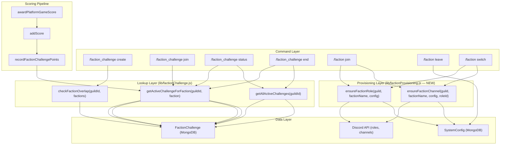
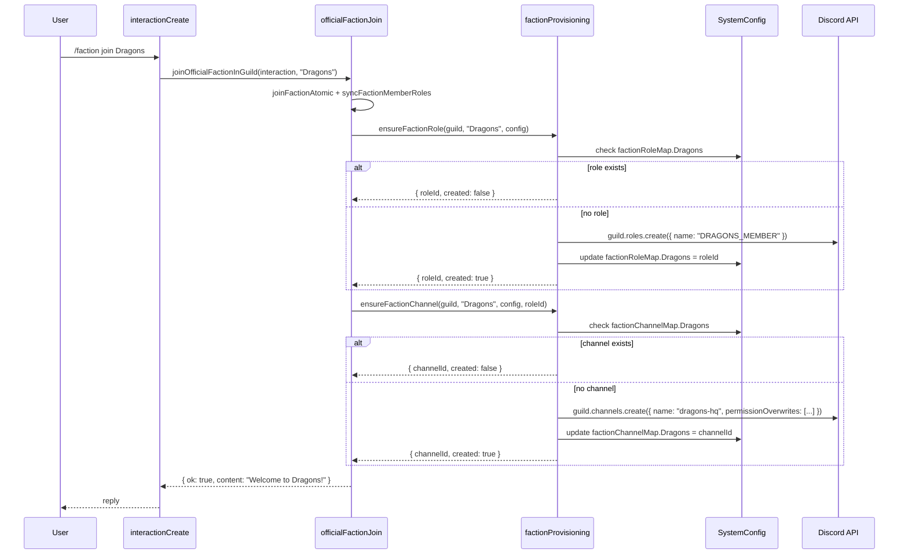

# Design Document: Faction Wars and Channels

## Overview

This design extends the PlayBound Discord bot to support (A) multiple concurrent faction wars per guild and (B) automatic provisioning of faction-specific Discord roles and private channels. Today, `getActiveChallenge(guildId)` returns at most one active `FactionChallenge` — the entire scoring pipeline, status display, join, and end flows assume a single war. The new design replaces single-challenge lookups with faction-aware queries so multiple wars coexist as long as no faction appears in more than one active war at a time. Separately, the manual `/faction_role_link` workflow is augmented with automatic role and channel creation on `/faction join`.

### Key Design Decisions

1. **Faction-scoped queries instead of guild-scoped singletons** — `getActiveChallenge(guildId)` becomes `getActiveChallengeForFaction(guildId, factionName)` and `getAllActiveChallenges(guildId)`. The existing `checkFactionOverlap` already validates faction uniqueness across active wars.
2. **Lazy provisioning** — Roles and channels are created on first `/faction join` for that faction in a guild, not eagerly for all six factions. This avoids cluttering guilds where only two or three factions are active.
3. **SystemConfig as source of truth** — New fields `factionChannelMap` (parallel to existing `factionRoleMap`) store channel IDs. Existing `factionRoleMap` entries are respected; auto-provisioning only fills empty slots.
4. **Backward compatibility** — `/faction_role_link` continues to work and overrides auto-created roles. Guilds that already configured roles manually see no behavior change.

## Architecture



### Change Scope

| File | Change |
|------|--------|
| `lib/factionChallenge.js` | Add `getActiveChallengeForFaction`, `getAllActiveChallenges`. Refactor `recordFactionChallengePoints` and `isUserEnrolledInActiveFactionChallenge` to use faction-scoped lookup. Update `expireStaleChallenges` to handle multiple active wars. |
| `lib/factionProvisioning.js` (NEW) | `ensureFactionRole`, `ensureFactionChannel` — lazy creation + SystemConfig persistence. |
| `lib/officialFactionJoin.js` | Call provisioning after `syncFactionMemberRoles`. |
| `lib/factionGuild.js` | `syncFactionMemberRoles` unchanged — already handles role map. |
| `src/events/interactionCreate.js` | Replace `getActiveChallenge` with faction-aware lookups in create/join/status/end handlers. Add `all` option to status and end. Route war announcements to faction channels. |
| `lib/announcements.js` | Add `announceFactionWarToFactionChannels` — posts embed to each participating faction's channel. |
| `models.js` | Add `factionChannelMap` field to `SystemSchema` (same shape as `factionRoleMap`). |

## Components and Interfaces

### 1. Faction-Aware Challenge Lookup (`lib/factionChallenge.js`)

```js
/**
 * Find the active war that includes the given faction.
 * @param {string} guildId
 * @param {string} factionName — canonical faction name
 * @returns {Promise<FactionChallenge|null>}
 */
async function getActiveChallengeForFaction(guildId, factionName) { ... }

/**
 * Return all active wars in a guild.
 * @param {string} guildId
 * @returns {Promise<FactionChallenge[]>}
 */
async function getAllActiveChallenges(guildId) { ... }
```

`getActiveChallengeForFaction` queries `FactionChallenge.find({ guildId, status: 'active', endAt: { $gt: now } })` then filters in-memory for the war whose `teamNames()` includes `factionName`. This reuses the existing `teamNames` helper (handles both duel and royale). The in-memory filter is acceptable because a guild will have at most 3 concurrent wars (6 factions / 2 per duel).

The existing `getActiveChallenge` is kept but deprecated — callers that need a specific faction's war migrate to `getActiveChallengeForFaction`.

### 2. Faction Provisioning (`lib/factionProvisioning.js` — NEW)

```js
/**
 * Ensure a Discord role exists for the faction in this guild.
 * If factionRoleMap already has an entry, returns that role ID.
 * Otherwise creates `{FACTION_NAME}_MEMBER` and persists to SystemConfig.
 * @returns {Promise<{ roleId: string|null, created: boolean, error: string|null }>}
 */
async function ensureFactionRole(guild, factionName, config) { ... }

/**
 * Ensure a private text channel exists for the faction.
 * If factionChannelMap already has an entry, returns that channel ID.
 * Otherwise creates `{faction-name}-hq` with permissions locked to the faction role + bot.
 * @returns {Promise<{ channelId: string|null, created: boolean, error: string|null }>}
 */
async function ensureFactionChannel(guild, factionName, config, roleId) { ... }
```

Both functions are idempotent. They check SystemConfig first, then Discord, then create if missing. On permission errors they return `{ error: '...' }` instead of throwing.

### 3. War Announcement to Faction Channels (`lib/announcements.js`)

```js
/**
 * Post war announcement embed to each participating faction's private channel.
 * Falls back to guild announce channel if no faction channel exists.
 * @param {Client} client
 * @param {string} guildId
 * @param {SystemConfig} config
 * @param {string[]} factionNames — participating factions
 * @param {EmbedBuilder} embed — the war announcement embed
 */
async function announceFactionWarToFactionChannels(client, guildId, config, factionNames, embed) { ... }
```

### 4. Updated Command Handlers (`src/events/interactionCreate.js`)

| Command | Current | New |
|---------|---------|-----|
| `create` | Rejects if any active war exists | Rejects only if specified factions overlap with an existing active war (uses `checkFactionOverlap`) |
| `join` | `getActiveChallenge(guildId)` | `getActiveChallengeForFaction(guildId, user.faction)` |
| `status` | Shows single war | Default: user's faction war. `all` option: summary of all active wars |
| `end` | Ends single war | Default: user's faction war. `faction` option: specific faction's war. `all`: ends all |


## Data Models

### SystemConfig Changes

Add `factionChannelMap` to `SystemSchema` (parallel to existing `factionRoleMap`):

```js
// models.js — inside SystemSchema
/** Discord channel id per global faction (auto-provisioned private HQ). */
factionChannelMap: { type: FactionGuildSlotSchema, default: () => ({}) },
```

`FactionGuildSlotSchema` already has slots for all six factions (`Phoenixes`, `Unicorns`, `Fireflies`, `Dragons`, `Wolves`, `Eagles`) with `String` type and `null` default — reused as-is.

### FactionChallenge — No Schema Changes

The existing `FactionChallengeSchema` already supports multiple active documents per guild. The current single-war constraint is enforced in application code (`getActiveChallenge` returns `findOne`), not by a unique index. The existing index `{ guildId: 1, status: 1 }` efficiently supports the new `find({ guildId, status: 'active' })` query.

### Query Patterns

| Operation | Current Query | New Query |
|-----------|--------------|-----------|
| Find user's war | `findOne({ guildId, status: 'active' })` | `find({ guildId, status: 'active', endAt: { $gt: now } })` + filter by `teamNames().includes(faction)` |
| Check overlap on create | `getActiveChallenge` (single) | `checkFactionOverlap(guildId, [factionA, factionB])` (already exists) |
| Expire stale | `find({ guildId, status: 'active', endAt: { $lte: now } })` | Same query — already returns all stale wars |
| Score routing | `findOne({ guildId, status: 'active' })` | `find({ guildId, status: 'active', endAt: { $gt: now } })` + filter by user's faction |

### Provisioning Flow (Sequence)




## Correctness Properties

*A property is a characteristic or behavior that should hold true across all valid executions of a system — essentially, a formal statement about what the system should do. Properties serve as the bridge between human-readable specifications and machine-verifiable correctness guarantees.*

### Property 1: Faction overlap determines war creation outcome

*For any* guild with zero or more active wars, and *for any* pair of factions `(fA, fB)`, attempting to create a new war succeeds if and only if neither `fA` nor `fB` appears in any existing active war's `teamNames()`. When creation is rejected, the response identifies the conflicting factions.

**Validates: Requirements 1.1, 1.2**

### Property 2: Faction uniqueness invariant

*For any* guild at any point in time, across all active wars (status `'active'` and `endAt > now`), each faction name from `GLOBAL_FACTION_KEYS` appears in at most one war's `teamNames()`.

**Validates: Requirements 1.4, 11.1**

### Property 3: Faction-aware lookup correctness

*For any* guild with multiple active wars and *for any* faction name, `getActiveChallengeForFaction(guildId, factionName)` returns the unique war whose `teamNames()` includes that faction, or `null` if no such war exists. This lookup is used by join, status, end, and enrollment checks.

**Validates: Requirements 2.1, 2.4, 5.4, 11.2**

### Property 4: Scoring routes to the correct war

*For any* enrolled user with faction `F` in a guild with multiple active wars, calling `recordFactionChallengePoints` with that user's `guildId`, `userId`, `factionName`, and a valid `gameTag` credits points only to the war containing faction `F`. All other active wars' `scoresByUser` and `rawScoresByUser` maps remain unchanged.

**Validates: Requirements 5.1, 5.2**

### Property 5: War isolation under mutation

*For any* guild with N active wars (N ≥ 2), ending or expiring one war (setting its status to `'ended'`, computing winner, applying global totals) does not modify the `status`, `participantsA/B`, `participantsByFaction`, `scoresByUser`, or `rawScoresByUser` of any other active war in the same guild.

**Validates: Requirements 1.3, 4.5, 6.2**

### Property 6: Independent expiration by endAt

*For any* set of active wars with distinct `endAt` timestamps, when `expireStaleChallenges` runs at time `T`, exactly those wars whose `endAt ≤ T` are set to `'ended'`, and all wars whose `endAt > T` remain `'active'`.

**Validates: Requirements 6.1, 6.3**

### Property 7: Provisioning naming convention

*For any* faction name `F` in `GLOBAL_FACTION_KEYS`, `ensureFactionRole` creates a role named `{F.toUpperCase()}_MEMBER` and `ensureFactionChannel` creates a channel named `{F.toLowerCase()}-hq`.

**Validates: Requirements 7.2, 8.1**

### Property 8: Provisioning idempotency and backward compatibility

*For any* faction in a guild, calling `ensureFactionRole` (or `ensureFactionChannel`) multiple times returns the same `roleId` (or `channelId`) and does not create duplicates. If `SystemConfig.factionRoleMap[F]` already has a value before the first call, that value is returned without creating a new Discord role.

**Validates: Requirements 7.4, 8.3, 8.4, 12.1**

### Property 9: Channel permission lockdown

*For any* faction channel created by `ensureFactionChannel`, the channel's permission overwrites deny `ViewChannel` for `@everyone` and grant `ViewChannel` + `SendMessages` only to the corresponding faction role and the bot's own role.

**Validates: Requirements 8.2**

## Error Handling

| Scenario | Handling |
|----------|----------|
| Bot lacks `MANAGE_ROLES` permission | `ensureFactionRole` catches the Discord API error, returns `{ roleId: null, error: 'Missing Manage Roles permission' }`. The join flow logs the error and appends a warning to the user's reply. Faction membership still succeeds (role is optional). |
| Bot lacks `MANAGE_CHANNELS` permission | `ensureFactionChannel` catches the error, returns `{ channelId: null, error: 'Missing Manage Channels permission' }`. Same graceful degradation — faction join succeeds without a private channel. |
| Role or channel deleted externally | On next `/faction join` for that faction, the provisioning function detects the stored ID points to a non-existent Discord object (fetch returns null), clears the stale ID from SystemConfig, and re-creates. |
| Race condition: two users join the same faction simultaneously | `ensureFactionRole` and `ensureFactionChannel` use optimistic check-then-create. If two calls race, the second `guild.roles.create` succeeds but the SystemConfig update uses `findOneAndUpdate` with a condition that the slot is still null — the loser's newly created role is deleted. Alternatively, the second call can detect the slot is already filled and skip creation. |
| `checkFactionOverlap` race on concurrent creates | Two `/faction_challenge create` commands for overlapping factions could both pass the overlap check. Mitigation: the create handler re-checks after `FactionChallenge.create` and rolls back (deletes the document) if a conflict is detected. The existing daily war cap (3/day) limits the blast radius. |
| User's faction is null during scoring | `recordFactionChallengePoints` already returns `NO_POINTS_OR_FACTION` when `factionName` is falsy — no change needed. |
| `getAllActiveChallenges` returns empty array | Status and end commands display "No active wars in this server." |

## Testing Strategy

### Unit Tests (Example-Based)

Focus on specific scenarios and edge cases:

- `/faction_challenge create` rejects when a specific faction is already in an active war (mock DB)
- `/faction_challenge join` with no faction returns error message (Req 2.3)
- `/faction_challenge status` shows user's war vs all wars vs `all` flag (Req 3.1–3.3)
- `/faction_challenge end` with faction argument, without argument, and `all` (Req 4.1–4.4)
- Point-cap finalization ends only the capped war (Req 5.5)
- `ensureFactionRole` returns error object when Discord API rejects (Req 7.5)
- `ensureFactionChannel` returns error object when Discord API rejects (Req 8.5)
- War announcement sent to faction channels + announce channel (Req 9.1–9.3)
- `/faction leave` removes role (Req 10.1)
- `/faction switch` removes old role, provisions new role+channel if needed (Req 10.2, 10.4)
- `/faction_role_link` overrides auto-provisioned role (Req 12.2–12.3)
- User removed from war roster on faction leave (Req 11.3)

### Property-Based Tests

Library: **fast-check** (already available in the Node.js ecosystem; minimum 100 iterations per property).

Each property test references its design property via tag comment:

| Property | Test Description | Tag |
|----------|-----------------|-----|
| 1 | Generate random faction pairs and existing active wars; verify create succeeds iff no overlap | `Feature: faction-wars-and-channels, Property 1: Faction overlap determines war creation outcome` |
| 2 | Generate random sequences of war creates; verify faction uniqueness invariant holds after each | `Feature: faction-wars-and-channels, Property 2: Faction uniqueness invariant` |
| 3 | Generate multiple active wars with random factions; for random faction, verify lookup returns correct war or null | `Feature: faction-wars-and-channels, Property 3: Faction-aware lookup correctness` |
| 4 | Generate multiple wars with enrolled users; call scoring for random user; verify only correct war's scores change | `Feature: faction-wars-and-channels, Property 4: Scoring routes to the correct war` |
| 5 | Generate N wars; end one; verify others unchanged | `Feature: faction-wars-and-channels, Property 5: War isolation under mutation` |
| 6 | Generate wars with random endAt; run expiration at random time T; verify correct subset expires | `Feature: faction-wars-and-channels, Property 6: Independent expiration by endAt` |
| 7 | For each faction name, verify role name is `{NAME}_MEMBER` and channel name is `{name}-hq` | `Feature: faction-wars-and-channels, Property 7: Provisioning naming convention` |
| 8 | Call ensureFactionRole/Channel twice; verify same ID returned, no duplicates | `Feature: faction-wars-and-channels, Property 8: Provisioning idempotency and backward compatibility` |
| 9 | For any created faction channel, verify permission overwrites deny @everyone and allow faction role + bot | `Feature: faction-wars-and-channels, Property 9: Channel permission lockdown` |

### Integration Tests

- End-to-end flow: create war → join → play game → score credited → end war → verify global totals
- Provisioning flow: `/faction join` in a fresh guild → role created → channel created → permissions correct
- Concurrent war lifecycle: create two duel wars → both score independently → one expires → other continues
