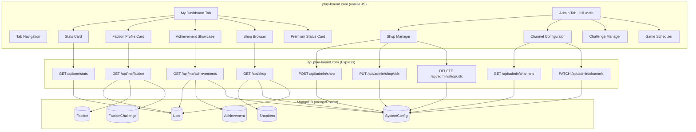
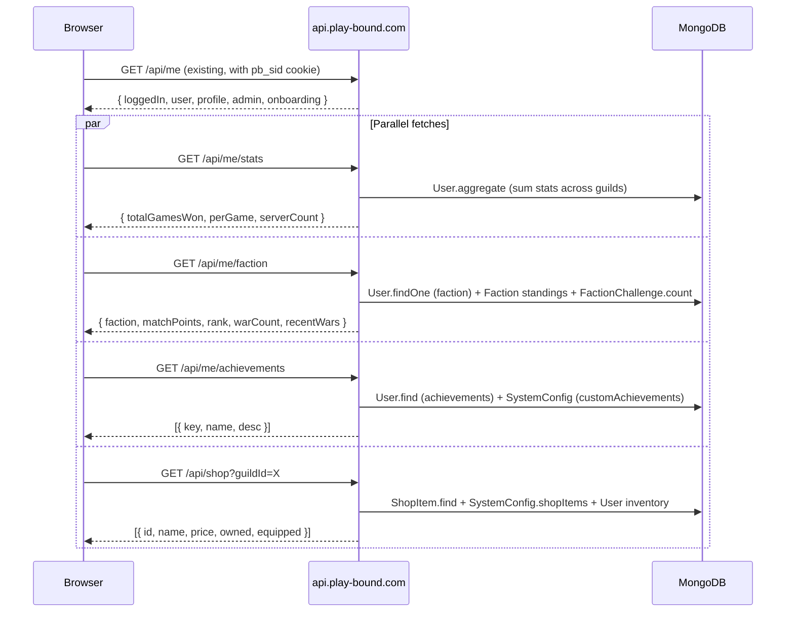
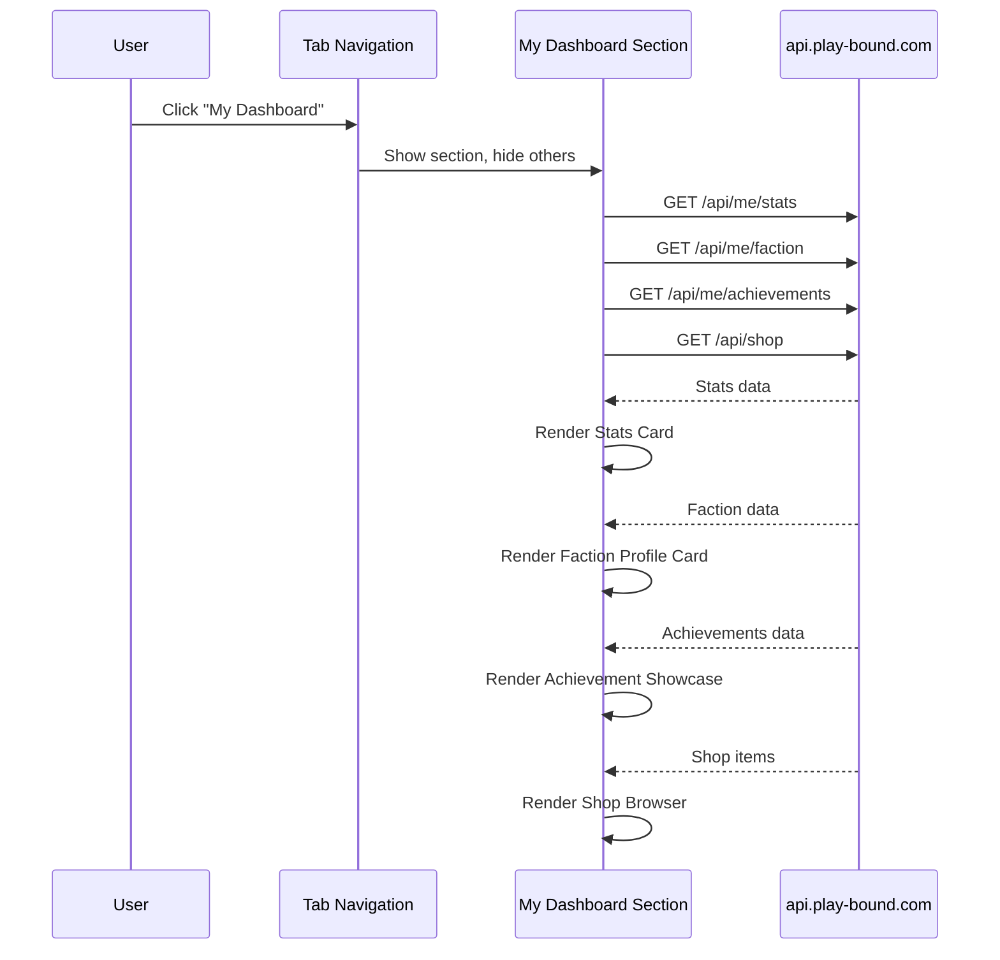

# Design Document: Web Dashboard Hub

## Overview

This design transforms the PlayBound website (play-bound.com) from a marketing landing page into a full authenticated web dashboard. The work spans two codebases:

- **Backend** (`discord-bot/discord-bot-games/src/server/api/`): New Express route modules for stats, shop, faction, achievement, and channel configuration APIs
- **Frontend** (`lucht-applications/play-bound/index.html`): New tab sections, cards, and admin panels in the existing vanilla JS single-page app

The dashboard reuses the existing Discord OAuth session (`pbSession`), the `mongoRouter` dual-DB pattern, and the `requireAdminSession` / `requireGuildAccess` middleware from `adminAuth.js`. No new frameworks or build tools are introduced.

## Architecture



### Data Flow: Authenticated Page Load



## Components and Interfaces

### New API Route Modules

All new routes follow the existing pattern: Express Router factories exported from modules in `src/server/api/`, registered in the main server setup.

#### 1. `meStatsRoutes.js` — `GET /api/me/stats`

```js
// Request: GET /api/me/stats (requires pbSession)
// Response 200:
{
  totalGamesWon: number,
  perGame: {
    trivia: number,
    serverdle: number,
    unscramble: number,
    tune: number,
    caption: number,
    sprint: number,
    guess: number
  },
  serverCount: number,       // distinct guilds with ≥1 win
  cachedAt: string            // ISO timestamp
}
// Response 401: { error: "login_required" }
```

Implementation: Uses `User.aggregate` with `$match` on userId (excluding `PUBLIC_STATS_EXCLUDE_GUILD_IDS`), `$group` to sum each `stats.*Wins` field, and a second `$group` on `guildId` with `$cond` to count distinct guilds with any win > 0. Wrapped in `mongoRouter.runWithForcedModels(getModelsProd(), ...)` like existing `/api/me`.

#### 2. `meFactionRoutes.js` — `GET /api/me/faction`

```js
// Response 200 (has faction):
{
  faction: {
    name: string,
    emoji: string,
    matchPoints: number,
    rank: number              // 1-indexed global rank by matchPoints
  },
  warCount: number,           // FactionChallenge docs where user is participant
  recentWars: [{
    challengeId: string,
    winnerFaction: string | null,
    userFaction: string,
    endedAt: string
  }],                         // last 10 by endedAt desc
  cachedAt: string
}
// Response 200 (no faction): { faction: null }
```

Implementation: Finds user's faction from any non-excluded User doc, looks up Faction standings via `getGlobalFactionStandingsFromUsers()` (already used in publicRoutes), counts FactionChallenge docs where userId appears in `participantsA`, `participantsB`, or any value array in `participantsByFaction`, and fetches last 10 ended challenges.

#### 3. `meAchievementsRoutes.js` — `GET /api/me/achievements`

```js
// Response 200:
{
  achievements: [{
    key: string,
    name: string,             // resolved from ACHIEVEMENTS or customAchievements
    desc: string | null       // null if key unresolvable
  }],
  cachedAt: string
}
```

Implementation: Fetches all User docs for userId, collects `achievements` arrays, deduplicates with `Set`, resolves each key using `resolveAchievementMeta(key, cfg)` from `lib/achievements.js` (checking built-in `ACHIEVEMENTS` first, then each guild's `customAchievements`).

#### 4. `shopRoutes.js` — `GET /api/shop`

```js
// Request: GET /api/shop?guildId=X (optional auth, optional guildId)
// Response 200:
{
  items: [{
    id: string,
    name: string,
    price: number,
    desc: string,
    type: string,             // consumable | cosmetic | badge | color | role
    premiumOnly: boolean,
    source: "global" | "server",
    owned: boolean | undefined,    // only if authenticated
    equipped: boolean | undefined  // only if authenticated
  }],
  cachedAt: string
}
```

Implementation: Fetches global `ShopItem.find({})`. If `guildId` provided, also fetches `SystemConfig.findOne({ guildId }).select('shopItems')` and merges. If authenticated, fetches user's `inventory` and `currentCosmetics` to compute `owned` (item id in inventory array or currentCosmetics values) and `equipped` (item id is a value in currentCosmetics map).

#### 5. `adminShopRoutes.js` — Shop CRUD

```js
// POST /api/admin/shop   { guildId, item: { name, price, desc, type, premiumOnly } }
// PUT  /api/admin/shop/:itemIndex  { guildId, item: { name, price, desc, type, premiumOnly } }
// DELETE /api/admin/shop/:itemIndex  { guildId }
```

All three use `requireAdminSession` + `requireGuildAccess`. POST appends to `SystemConfig.shopItems` via `$push`. PUT uses positional update. DELETE uses `$unset` + `$pull`. Returns 404 if index out of bounds, 403 if no guild access.

#### 6. `adminChannelRoutes.js` — Channel Configuration

```js
// GET /api/admin/channels?guildId=X
// Response 200:
{
  channels: [{ id: string, name: string }],  // from Discord guild cache
  assignments: {
    announceChannel: string | null,
    welcomeChannel: string | null,
    birthdayChannel: string | null,
    achievementChannel: string | null,
    leaderboardChannel: string | null,
    storyChannel: string | null
  }
}

// PATCH /api/admin/channels  { guildId, updates: { announceChannel: "123", welcomeChannel: null } }
// Response 200: { ok: true }
// Response 400: { error: "invalid_channel" }  // if channelId not in guild
```

GET reads guild channels from `client.guilds.cache.get(guildId).channels.cache` filtered to text channels, plus current SystemConfig assignments. PATCH validates each channelId exists in the guild before updating SystemConfig.

### Frontend Component Structure

The frontend remains a single `index.html` with inline CSS/JS. New sections are added as tab content panels following the existing pattern.

```
Tab Bar
├── Home (existing)
├── Play Hub (existing)
├── Leaderboards (existing)
├── Seasons (existing)
├── My Dashboard (NEW — auth only)
│   ├── Stats Card
│   ├── Faction Profile Card
│   ├── Achievement Showcase
│   ├── Shop Browser
│   │   └── Server Selector dropdown
│   └── Premium Status Card
│       └── Boost History (premium only)
└── Admin (NEW — replaces drawer, admin only)
    ├── Server Selector
    └── Sub-tabs:
        ├── Overview (existing logic, new layout)
        ├── Games (existing + Game Scheduler)
        ├── Economy (existing)
        ├── Factions (existing + Challenge Manager)
        ├── Shop (NEW — Shop Manager)
        ├── Channels (NEW — Channel Configurator)
        ├── Referrals (existing)
        ├── Automation (existing)
        ├── Roles (existing)
        └── Audit (existing)
```

Each new section follows the existing card pattern:
- Container `<section>` with `id` for tab switching
- Cards use `.surface-elevated` background, `.border` borders, `border-radius: 14px`
- Error states: inline `.pb-error` div with retry button
- Loading states: skeleton placeholder matching card dimensions
- Mobile: CSS grid with `grid-template-columns: 1fr` below 768px

### Frontend Data Flow



## Data Models

No new Mongoose schemas are required. All new endpoints read from existing models:

| Endpoint | Models Read | Models Written |
|----------|------------|----------------|
| `GET /api/me/stats` | User | — |
| `GET /api/me/faction` | User, Faction, FactionChallenge | — |
| `GET /api/me/achievements` | User, SystemConfig | — |
| `GET /api/shop` | ShopItem, SystemConfig, User | — |
| `POST /api/admin/shop` | SystemConfig | SystemConfig |
| `PUT /api/admin/shop/:idx` | SystemConfig | SystemConfig |
| `DELETE /api/admin/shop/:idx` | SystemConfig | SystemConfig |
| `GET /api/admin/channels` | SystemConfig, Discord cache | — |
| `PATCH /api/admin/channels` | SystemConfig, Discord cache | SystemConfig |

### Key Schema Fields Used

**User** (per-guild): `stats.{gamesWon, triviaWins, serverdleWins, unscrambleWins, tuneWins, captionWins, sprintWins, guessWins}`, `faction`, `inventory`, `currentCosmetics`, `achievements`, `isPremium`, `premiumSource`

**SystemConfig** (per-guild): `shopItems[]`, `customAchievements[]`, `announceChannel`, `welcomeChannel`, `birthdayChannel`, `achievementChannel`, `leaderboardChannel`, `storyChannel`

**ShopItem** (global): `id`, `name`, `price`, `desc`, `type`, `premiumOnly`, `profileColorHex`, `leaderboardEmoji`

**FactionChallenge**: `participantsA[]`, `participantsB[]`, `participantsByFaction` (Map), `winnerFaction`, `endedAt`, `status`

## Correctness Properties

*A property is a characteristic or behavior that should hold true across all valid executions of a system — essentially, a formal statement about what the system should do. Properties serve as the bridge between human-readable specifications and machine-verifiable correctness guarantees.*

### Property 1: Stats aggregation with guild exclusion

*For any* set of User documents across multiple guilds and any set of excluded guild IDs, the stats aggregation SHALL return per-game win sums and a distinct server count that include only non-excluded guilds. The total of each stat field must equal the sum of that field across all User documents whose guildId is not in the exclusion set.

**Validates: Requirements 1.1, 1.2, 1.5**

### Property 2: Stats display format

*For any* non-negative integer win count N and positive integer server count M, the stats card format function SHALL produce a string matching the pattern `"{N} wins across {M} servers"` where N and M are the exact input values.

**Validates: Requirements 2.2**

### Property 3: Shop item merge completeness

*For any* set of global ShopItem documents and any server-specific shopItems array, the merged shop response SHALL contain every item from both sources, and each item SHALL include the fields: id, name, price, desc, type, and premiumOnly.

**Validates: Requirements 3.1, 3.2**

### Property 4: Shop ownership flag correctness

*For any* shop item and any user inventory array and currentCosmetics map, the `owned` flag SHALL be true if and only if the item's id appears in the inventory array or as a value in the currentCosmetics map, and the `equipped` flag SHALL be true if and only if the item's id appears as a value in the currentCosmetics map.

**Validates: Requirements 3.3, 3.4**

### Property 5: Shop item rendering completeness

*For any* shop item with non-empty name, positive price, non-empty description, and valid type, the rendered shop item HTML SHALL contain the item's name, price, description, and type text.

**Validates: Requirements 4.6**

### Property 6: Faction rank computation

*For any* set of faction standings sorted by matchPoints descending, the rank returned for a player's faction SHALL equal 1 plus the count of factions with strictly higher matchPoints.

**Validates: Requirements 6.1**

### Property 7: Challenge participation count

*For any* set of FactionChallenge documents and any userId, the participation count SHALL equal the number of documents where the userId appears in participantsA, participantsB, or any value array within participantsByFaction.

**Validates: Requirements 6.2**

### Property 8: War history recency

*For any* set of completed FactionChallenge documents where the user participated, the returned recent wars list SHALL contain at most 10 entries sorted by endedAt descending, and every omitted entry SHALL have an endedAt earlier than or equal to the earliest returned entry.

**Validates: Requirements 6.3**

### Property 9: Achievement deduplication across guilds

*For any* collection of User documents across multiple guilds for the same userId, the returned achievements list SHALL contain exactly the set-union of all achievement keys with no duplicates.

**Validates: Requirements 7.3, 8.1**

### Property 10: Achievement key resolution

*For any* achievement key, if the key exists in the built-in ACHIEVEMENTS map, the resolved name and description SHALL match the built-in entry. If the key exists only in a guild's customAchievements, the resolved name and description SHALL match the custom entry. If the key exists in neither, the name SHALL be the raw key and description SHALL be null.

**Validates: Requirements 7.2, 8.2, 8.3**

### Property 11: Shop item validation rejects invalid inputs

*For any* shop item where the name is empty (or whitespace-only) or the price is not a positive integer, the validation function SHALL reject the input and return an error.

**Validates: Requirements 11.6**

## Error Handling

All new API endpoints follow the existing error patterns in the codebase:

| Scenario | HTTP Status | Error Code | Notes |
|----------|-------------|------------|-------|
| No session cookie | 401 | `login_required` | Consistent with existing `/api/me` |
| Session exists but no admin access | 403 | `forbidden` | Uses `requireAdminSession` |
| Admin but wrong guild | 403 | `forbidden_guild` | Uses `requireGuildAccess` |
| Missing required param (guildId) | 400 | `guildId_required` | Existing pattern |
| Shop item index out of bounds | 404 | `item_not_found` | New |
| Invalid channel ID in PATCH | 400 | `invalid_channel` | New |
| Internal error | 500 | `{route}_unavailable` | e.g. `stats_unavailable` |

Frontend error handling:
- Each card/section has an error state with inline message and retry button
- Retry re-calls the failed fetch
- Network errors show "Connection failed — check your internet and try again"
- 401 errors redirect to the login flow

## Testing Strategy

### Backend (Jest)

**Unit tests** for each new route module:
- `meStatsRoutes.test.js`: Mock User.aggregate, verify correct aggregation pipeline, verify 401 for no session, verify guild exclusion
- `meFactionRoutes.test.js`: Mock User/Faction/FactionChallenge queries, verify response shape, verify no-faction case
- `meAchievementsRoutes.test.js`: Mock User.find, verify deduplication, verify resolution with built-in and custom achievements
- `shopRoutes.test.js`: Mock ShopItem/SystemConfig/User, verify merge logic, verify owned/equipped flags, verify unauthenticated response
- `adminShopRoutes.test.js`: Mock SystemConfig, verify CRUD operations, verify index bounds, verify auth
- `adminChannelRoutes.test.js`: Mock Discord cache and SystemConfig, verify channel list, verify PATCH validation

**Property-based tests** (using `fast-check`):
- Each correctness property above gets a dedicated property test with minimum 100 iterations
- Tag format: `Feature: web-dashboard-hub, Property {N}: {title}`
- Pure logic functions (aggregation, merge, ownership flags, validation, dedup, resolution, formatting) are extracted into testable modules

### Frontend (Playwright)

**Smoke tests** extending `lucht-applications/play-bound/tests/smoke.spec.js`:
- Mock new API endpoints in `mock-api.js`
- Test "My Dashboard" tab visibility for logged-in vs guest
- Test stats card renders with mock data
- Test shop browser renders items grouped by type
- Test admin tab renders full-width with sub-tabs
- Test mobile viewport stacks cards vertically
- Test API failure shows error + retry button

**Example-based tests**:
- Owned/equipped badges appear on correct items
- Premium indicators on premiumOnly items
- Channel configurator dropdowns populated
- Server selector triggers data reload
